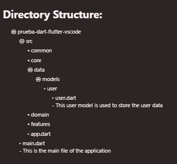

# flutter-tree

### Features

Install the plugin, press ```ctrl+shift+p``` and enter ```Flutter Tree: Open Panel``` to enter. Generate a project tree structure with comments in a new group.

### Extension Settings

settings:

- ```flutter-tree.openPanel```: Generate a project tree structure with comments in a new group.

---

### Example
<p align = center > </p>

**Enjoy!**
